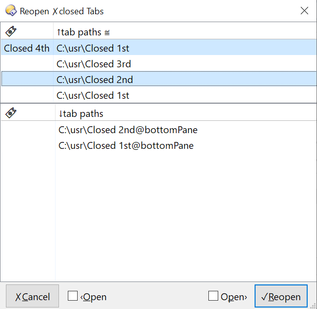
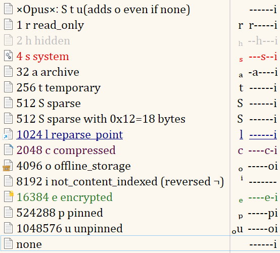
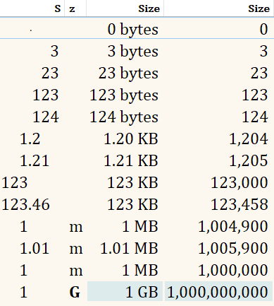

Extensions of the Directory Opus file manager
 
(Windows)

  

## Introduction

## Install

Copy the required scripts (and the `inc_xx.js` libraries they depend on) to your `%AppData%\GPSoftware\Directory Opus\Script AddIns` folder.

## Use

- [Cmd.JumpItem↕](./Cmd.JumpItem↕.js) jump ↑/↓ by an arbitrary number of items with/out selection
- [cb.FilterToggleOnThemeΔ](./cb.FilterToggleOnThemeΔ.js) automatically toggle Dark/Light variant of "Labels/Label Assignment" filter labels on Dark/Light Mode changes
- [Cmd.TabDedupe](Cmd.TabDedupe) command to close duplicate tabs protecting current tab, can be added to your close/open tab buttons/shortcuts to avoid accumulating many duplicate tabs

### Backup
- [backup.LayoutOn⎋](./backup.LayoutOn⎋.js) automatically save Lister layout when a Lister using this layout is closed normally (doesn't save on crashes) and on layout changes after user defined period has elapsed (helps saving before a crash)
- [backup.TabUndo](./backup.TabUndo.js) fills one big gap in DOpus' **tab management** by adding an interface and commands to undo multiple closed tabs by storing each closed tab in a persistent (across restarts) Lister variable
  - `Undo✗TabVis` command invokes an interface with the list of tabs which you can use to select multiple tabs to reopen
    
    - tabs are reopened at the position they were close in if said position can be found (not very precise in the presence of multiple tabs with the same path unless they were also present when the tab is closed), otherwise can be configured to be reopened at the end of the tab bar or to the right of the active tab
    - tabs retain their manual 🔖labels
    - a list for each pane in a dual-pane lister is shown unless history for inactive pane is configured to be hidden
    - by default tabs are reopened at the same pane they were closed in unless a force flag `‹Open`/`Open›` is set
    - supports single-key shortcuts:
      - home row navigation without selection: <kbd>j</kbd>▼ <kbd>k</kbd>▲ (or <kbd>m</kbd>/<kbd>,</kbd> to jump by 5 (configurable) items)
      - home row navigation between panes: <kbd>d</kbd>left <kbd>f</kbd>right pane
      - selection <kbd>l</kbd>select <kbd>;</kbd>toggle selection (let me know if you find a way to just just deselect) (see script config for the full list of keybinds that you can also rebind)
      - <kbd>r</kbd>/<kbd>i</kbd>Confirm / <kbd>q</kbd>/<kbd>c</kbd>Cancel
      - <kbd>o</kbd>/<kbd>p</kbd> to force open in the left/right pane (sets `‹Open`/`Open›` flag)
    - supports custom names of each column via user config
  - `Undo✗Tab` command opens a single tab from history, but unlike the default DOpus command, you can use it multiple times to reopen earlier closed tabs (with `bg` flag you can open the tab without activating it)
  - `Undo✗TabClearHistory` clears history with a confirmation is the list is above a configurable threshold (but only for the active Lister due to DOpus limitations)
  An example [Undo ✗ Tab button](<./Undo ✗ Tab.dcf>) using a few of the commands:
    - opens the GUI listview on click
    - includes a tab undo (with and without switching to the reopened tab) and a button to clear history
- [backup.TabGroupSave🕘](./backup.TabGroupSave🕘.js) automatically saves opened tabs in a [Tab Group](https://docs.dopus.com/doku.php?id=basic_concepts:the_lister:tabs:tab_groups) on a timer so that you don't lose your precious tabs even in a crash. ⚠ deletes old tab groups starting with user defined prefix + index, so it's important to pick a prefix not used in other tab groups to avoid them being deleted.

### Columns
- [Column.AttrShort](./Column.AttrShort.js) adds a column with short file attributes (without `-` padding), which also displays `i` indexing status for those files that have content indexing enabled (default is otherwise, files with content indexing disabled have a confusing `i` indicator)
- [Column.Attr.Short.ε](./Evaluator/Column.Attr.Short.xml) (evaluator version of ↑), comparison to ≝
  
- [Column.SizeFormat](./Column.SizeFormat.js) adds columns with with shorter and vertically aligned size indicators that also allow custom handling of symlinks
- [Column.Size.Full.ε](./Evaluator/Column.Size.Full.xml) (right-aligned single column with value+label)[Column.Size.ε](./Evaluator/Column.Size.Format.xml) [Column.Size.Label.ε](./Evaluator/Column.Size.Label.xml) (left aligned, but separate columns for value and label) faster, but more formatting-limited evaluator version of ↑, comparison to ≝ (for more details see [Column.Size.Format.md](./doc/Column.Size.Format.md))
  
- [Column.FileAccess](./Column.FileAccess.js) to show file read-only/read-write/noaccess status with customizable labels
- [Column.Size.ε](./Column.FileAccess.js) to show file read-only/read-write/noaccess status with customizable labels

## Known issues
- [Column.SizeFormat](./Column.SizeFormat.js) not performant in folders with many items due to an unavoidable per-item JScript overhead, but looks nice :)
- [backup.TabUndo](./backup.TabUndo.js) has a bunch of issues mentioned in the [ToDos](./ToDos.md) along with missing features
- [Cmd.JumpItem↕](./Cmd.JumpItem↕.js)
  - ails with v13 Expanded folders (items' indices we get don't account for visual order)
  - JumpItem↕ isn't performant in folders with many items, use JumpItemCursor↕, but both have issues on key hold:
    - JumpItemCursor↕ is fluid, but on key release continues to execute for a few iterations
    - JumpItem↕ skips some executions; stops faster vs↑, but also not immediately
- [Cmd.TabDedupe](Cmd.TabDedupe) `TabDedupe dual noprotect` then `Go CURRENT NEWTAB` opens a new tab at the end of the tabbar insted of next to the last tab even though it's visibly selected
- [backup.TabGroupSave🕘](./backup.TabGroupSave🕘.js) can't create tab groups in a folder for some unknown reason, so they they "pollute" the general list instead

## Credits
