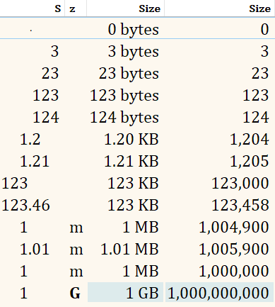

This is a partial conversion of the JS-scripting formatted and aligned size column to avoid the per-item JS scripting overhead (at the cost of convenient user configuration and others issues, see below). 

This addresses many of the space wasting and misalignment issues of the default size columns

(with comments)

Some of the benefits for compactness and alignment
  - ⸱ tiny dot for 0 instead of wasting '0 bytes' for nothing
      - ⸱
      - 0 bytes
  - Byte values are "visually smaller" since they are positioned to the right of the decimal point, so you don't need `b` and `kb` labels
      - `  120` bytes
      - `4.12`  kb
      - ↑ also `12` in KB is aligned to `120` in bytes
-  Rounding doesn't break alignment, so 1 is vertically aligned
      - `1   ` MB
      - `1.01` MB
      - `   1` MB (default size column)
    (and 1.21 kb is not bigger than 123 kb)
- Different label width in proportional fonts doesn't break alignment, so 1 is vertically aligned (actual misalignment depends on your font)
  - M 1
  - G 1
- Rich text labels: bold and uppercased > **G** label to signal bigger size
  - Could also red-color > **T** for even more prominence?

A few limitations:
  - no background **size graph** as that feature is not implemented for evaluator columns
  - 2 columns (value and label) instead of 1
    - with column padding the total width is bigger vs the default size column
    - less efficient, 2 evaluator calls instead of 1

(You could remove one extra space at the end of end of the value column to save a bit of extra width, but then would lose the valuable alignment of `123` b and `2.12` kb) 

**To install**
  - copy file's content to clipboard
    - [Column.Size.Format.xml](../Evaluator/Column.Size.Format.xml)
    - [Column.Size.Label.xml](../Evaluator/Column.Size.Label.xml)
  - open `Preferences / File Display Columns / Evaluator Columns`
  - click `Pas̲te`
  - add `Size.ε` and `Size.Label.ε` columns to your folder format (tip: try to move label to the left of the size as then in the absence of background graphs it might be a slightly more visible indicator of size)
